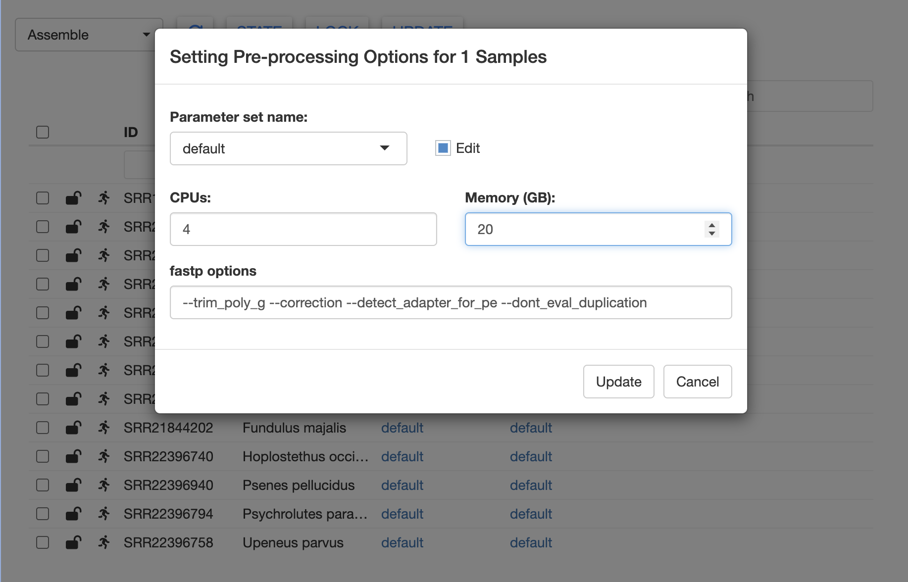

<style>
.alert {
  border-left: 5px solid;
  padding: 10px;
  margin: 10px 0;
  border-radius: 5px;
}
.alert-tip { border-color: #28A745; background-color: #E9F7EF; }
.alert-note { border-color: #007BFF; background-color: #EBF5FF; }
.alert-warning { border-color: #FFC107; background-color: #FFF9E6; }
.alert-danger { border-color: #DC3545; background-color: #F8D7DA; }
strong { font-weight: bold; }
</style>

# How to use MitoPilot on the Smithsonian Hydra computing cluster

You will need an account to access the Hyrda computing cluster. Instructions are available [here](https://confluence.si.edu/display/HPC/Hydra+Policies).

## First time setup

Dan MacGuigan has submitted a request to the Hydra team for installation of a Nextflow module. But for now, you will need to install your own copy of Nextflow on the cluster. Login to Hydra and run the following.

```{bash eval=F}
# Nextflow installation instructions
# from https://www.nextflow.io/docs/latest/install.html
cd ~
module load tools/java/21.0.2
curl -s https://get.nextflow.io | bash # install Nextflow
chmod +x nextflow # make Nextflow executable
```

There will now be an executable `nextflow` file in your home directory. You should move it to a location that is in your `PATH`. For example:

```{bash eval=F}
mkdir ~/bin # create bin directory, if needed
mv ~/nextflow ~/bin/nextflow # move nextflow to bin directory
echo 'export PATH="${HOME}/bin:${PATH}"' >> ~/.bashrc # add bin directory to PATH, in case it's not already there
source ~/.bashrc
```
 
This should allow you to call `nextflow` from anywhere on the cluster.

<div class="alert alert-note">
  <strong>Note:</strong> You must load the Hydra Java module (`module load tools/java/21.0.2`) whenever you wish to use Nextflow.
</div>


## Launching RStudio server

We will use RStudio server to run MitoPilot. RStudio server functions much like the RStudio on your local computer, but using the Hydra cluster's data storage and computational resources.

There are two ways to access RStudio server on Hydra.

### Tunneling to a RStudio server session

We recommend always using an interactive session when tunneling to RStudio server. This avoids unnecessary computational burden on the login nodes. To launch an interactive session, run the following.

```{bash eval=F}
qrsh -l h_rt=24:00:00 -pe mthread 2
```

<div class="alert alert-note">
  <strong>Note:</strong> You must include `-pe mthread 2` in order to have enough available RAM for building the MitoPilot Singularity image.
</div>

<div class="alert alert-note">
  <strong>Note:</strong> Interactive sessions on Hydra can run for a maximum of 24 hours. Additionally, users are limited to one active interactive session at a time.
</div>

Once your interactive session has started, launch RStudio server.

```{bash eval=F}
# avoid package conflicts (may not be necessary for all users)
conda deactivate 
# load the RStudio server module
module load tools/R/RStudio/server
# launch RStudio server
start-rstudio-server
```

<div class="alert alert-note">
  <strong>Note:</strong> If this is your first time launching RStudio server, you may be asked to run a different command.
</div>

You will see something like this printed to your screen.

```
start-rstudio-server: starting RStudio server on host=login02 and port=8787
  you need to create a ssh tunnel on your local machine with
    ssh -N -L 8787:login02:8787 macguigand@hydra-login01.si.edu

Point your browser to http://localhost:8787 on your local machine.
Use Control+C in this window to kill the server when done.

TTY detected. Printing informational message about logging configuration. Logging configuration loaded from '/etc/rstudio/logging.conf'. Logging to '/home/macguigand/.local/share/rstudio/log/rserver.log'.
```

<div class="alert alert-note">
  <strong>Note:</strong> If you get a message saying "ERROR system error 98 (Address already in use)", someone else has a tunnel established with the default port (8787). To fix this, try using a different port, e.g. `start-rstudio-server -port 8890`. Any port number between 1025-65535 is allowed.
</div>

Leave this cluster terminal window open, open a new terminal window on your local computer, and run the `ssh` command printed by `start-rstudio-server`.

```{bash eval=F}
ssh -N -L 8787:login02:8787 macguigand@hydra-login01.si.edu
```

Enter your Hydra password when prompted. If nothing happens, this means that you have successfully established a SSH tunnel and can connect to RStudio server.

Leaving both terminal windows open, enter [http://localhost:YOUR_PORT_NUMBER](http://localhost:YOUR_PORT_NUMBER) in a web browser. We recommend using Chrome or Firefox. There are some known issues running MitoPilot with Safari.

Enter your cluster login credentials to access the RStudio server. This should open a full RStudio session in your browser. Any R commands run in this RStudio window will execute on the cluster.

### RStudio Galaxy server

The Hydra Team recently launched a new interactive R Studio environment that is accessible directly via a browser, at [https://galaxy.si.edu/R4](https://galaxy.si.edu/R4).

Hydra users can leverage this server to test, debug, and develop R based workflows using the interactive R Studio GUI (currently running R 4.4.3).

By logging in with your Hydra account credentials, users will have access to the storage under /pool, /scratch and /store. This server offers resources totaling 192 CPUs and 1.5 T of RAM.

***Notes:***

1. This is a shared resource and should be used accordingly. Long running jobs or jobs requiring the entire resources of the server would be more appropriate as a job submission.
2. This server is only accessible from trusted computers, not on the public internet. However, if you can access Hydra, you should be able to access this server. For technical reasons, to access this resource via telework.si.edu, go to [https://galaxy.si.edu](https://galaxy.si.edu) and then choose the "R4 v443" option.
3. This is a new resource - please be patient as we test this offering with our user community. We will evaluate this test once Hydra is moved to the new data center and decide whether it should be kept or altered in any way.

## Installing MitoPilot

To install MitoPilot, use the RStudio server window to run the following. This might take a while.

```{R eval=F}
if (!requireNamespace("BiocManager", quietly = TRUE)) {
  install.packages("BiocManager")
  install.packages("remotes")
}
BiocManager::install("Smithsonian/MitoPilot")
```

If the installation was successful, you're ready to start using MitoPilot!

## Updating MitoPilot

If you need to update MitoPilot, simply run the BiocManager installation command again. 
If you would like to ensure that you’re using the latest MitoPilot version, run `remove.packages("MitoPilot")` prior to installation.

After updating MitoPilot, we recommend restarting R (in RStudio, Session > Restart R or run `.rs.restartR()`) and then reloading the package with `library(MitoPilot)`.

We also recommend clearing your Singularity cache with `singularity cache clean` to ensure you are using the latest MitoPilot Singularity image. 

## Launching MitoPilot

To load the MitoPilot R package, run `library(MitoPilot)` within your RStudio server session. You can now utilize all of MitoPilot's functions, such as [initializing a project](https://smithsonian.github.io/MitoPilot/#initializing-a-project) or [opening the R Shiny GUI](https://smithsonian.github.io/MitoPilot/#running-the-pipeline). 

Want to learn how to use MitoPilot? Check out the [Test Project Tutorial](https://Smithsonian.github.io/MitoPilot/articles/test-project.html).

## Running Large MitoPilot Jobs
If you have a large number of samples to process (more than a few dozen), we recommend running the assemble and annotate MitoPilot modules as batch jobs. 

Running these modules within the R Shiny GUI requires you to maintain an open connection to the cluster. There may be issues restarting if the connection breaks while Nextflow is running. Instead, we can "fire and forget" by submitting batch jobs.

First, initialize your new project and modify any desired parameters using the GUI. Once ready, click `UPDATE`. A new window should appear.



Rather than clicking the `Start Nextflow` button, copy the Nextflow command and create a submission script. We have provided a template below. You may wish to modify the job name (`-N`) and the log file name (`-o`).

```{bash eval=F}
#!/bin/sh
#$ -N MitoPilot_assembly # MODIFY THIS IF DESIRED
#$ -o MitoPilot_assembly.log # MODIFY THIS IF DESIRED
#$ -cwd -j y
#$ -q lTWFM.sq
#$ -l wfmq
#$ -pe mthread 2
#$ -S /bin/sh

echo + `date` job $JOB_NAME started in $QUEUE with jobID=$JOB_ID on $HOSTNAME

source ~/.bashrc

module load tools/java/21.0.2 # required for Nextflow on Hydra

# NEXTFLOW COMMAND, example below
nextflow -log /pool/public/genomics/macguigand/MitoPilot/22030FL-06-02/run_02/.logs/nextflow.log run /home/macguigand/R/x86_64-pc-linux-gnu-library/4.4/MitoPilot/nextflow -c /pool/public/genomics/macguigand/MitoPilot/22030FL-06-02/run_02/.config -entry WF1

echo = `date` job $JOB_NAME done

```

<div class="alert alert-note">
  <strong>Note:</strong> You must use the options `-q lTWFM.sq` and `-l wfmq`. This is a special Hydra queue for workflow managers like Nextflow. You must also include `-pe mthread 2` in order to have enough available RAM for building the MitoPilot Singularity image.
</div>

Move the submission script into your MitoPilot run directory (in the above example, `/pool/public/genomics/macguigand/MitoPilot/22030FL-06-02/run_02/`). Then submit the job using `qsub MY_SCRIPT_NAME.sh`.

You can monitor the progress of this job using the `qstat` command and by checking on the log files. Once the job is done, you can relaunch the GUI to inspect the results. The same approach can be used for the annotate module.

## Known Issues

If when launching RStudio server you receive the error message `[rserver] ERROR system error 98 (Address already in use);`, the TCP port is already in use by another user.
Specify a different port in the range of 1025-65535 when starting the server. E.g., `start-studio-server -port 8890`.
